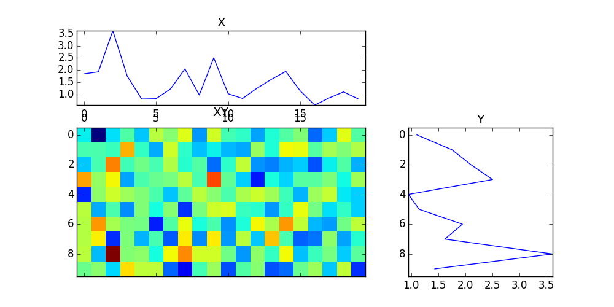
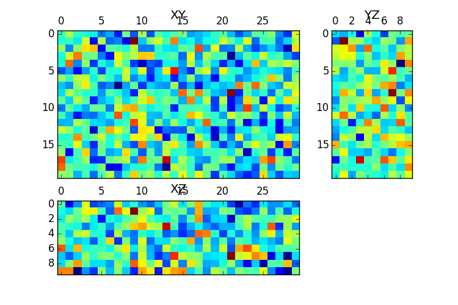

#dphplotting

dphplotting is a package that contains modules used to make pretty plots

##mip.py

This is a module that has one exposed function `mip(data)` to the user. It will determine the size of the `data` and perform the appropriate plotting. It returns the figure reference and the axes reference such that the axes are ordered `(z, y, x)`.

---

###Parameters

- `data` the data to be plotted
- `**kwargs` space for extra arguments (_not yet implemented_)

---

###Example

```python

from dphplotting.mip import mip
import numpy as np

data = np.random.randn(10,20)
fig, ax = mip(data)
fig.savefig('dphmp2D.png')

data = np.random.randn(10,20,30)
fig, ax = mip(data)
fig.savefig('dphmp3D.png')

```

Which produces



and



---

###Errors

A `TypeError` will be raised if the data does not have 2 or 3 dimensions.
